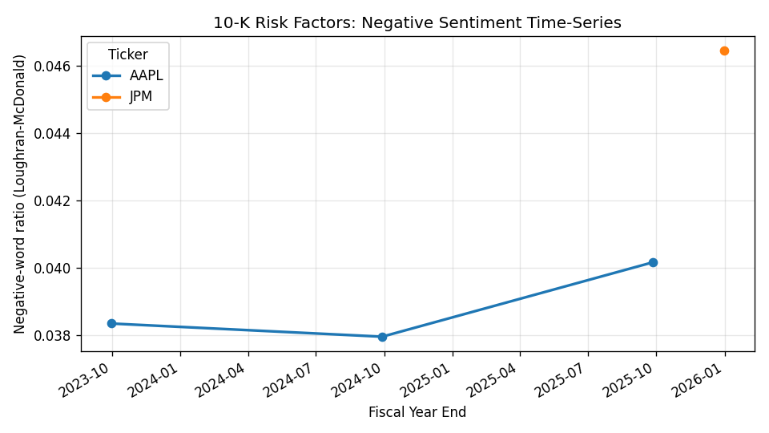

# m1-sec-10k-sentiment

> SEC 10-K Risk Factor sentiment analyzer using the Loughran-McDonald financial lexicon. Time-series tone tracking for fundamental research and equity analysis.

[](https://github.com/ypatel39-commits/m1-sec-10k-sentiment/actions/workflows/test.yml)
[](https://www.python.org/)
[](LICENSE)

---

## Demo



```text
$ sec10k -t AAPL -t MSFT -t JPM --limit 3
ticker     fy_end  tokens  negative_ratio  net_sentiment  negative_yoy_delta
  AAPL 2023-09-30   10042          0.0383        -0.0299                 NaN
  AAPL 2024-09-28   10172          0.0379        -0.0295            -0.0004
  AAPL 2025-09-27   10034          0.0402        -0.0300            +0.0022   <- tone deteriorating
   JPM 2025-12-31   15838          0.0465        -0.0370                 NaN
```

Full output: [`docs/cli-demo.txt`](docs/cli-demo.txt) | Raw scores: [`docs/sample-output.csv`](docs/sample-output.csv)

---

## Why this exists

Equity research and asset management analysts read 10-K Risk Factor sections (Item 1A) looking for **shifts in management tone year-over-year**. A subtle increase in negative sentiment can flag emerging operational, regulatory, or competitive headwinds before they show up in numbers.

Doing this by hand on 50 portfolio companies × 5 years × ~70 pages of legal prose is impossible. This tool automates the workflow: fetch from EDGAR, extract Risk Factors, score with the academic-standard Loughran-McDonald financial lexicon, and visualize the tone time-series.

## What it does

```
$ sec10k -t AAPL -t MSFT -t JPM --limit 3
ticker     fy_end  tokens  negative_ratio  net_sentiment  negative_yoy_delta
  AAPL 2023-09-30   10042         0.03834       -0.02987                 NaN
  AAPL 2024-09-28   10172         0.03795       -0.02949            -0.00039
  AAPL 2025-09-27   10034         0.04016       -0.03000            +0.00222  ← tone deteriorating
   JPM 2025-12-31   15838         0.04647       -0.03700                 NaN
```

- Fetches 10-K filings from SEC EDGAR (free, no API key — uses polite User-Agent per SEC guidance)
- Extracts Item 1A "Risk Factors" via regex (skips the table-of-contents copy)
- Scores with Loughran-McDonald lexicon (200 most discriminative finance terms)
- Computes year-over-year tone deltas
- Streamlit dashboard for interactive exploration

## Sample run (real data)

| ticker | fy_end | tokens | negative_ratio | net_sentiment | Δ negative YoY |
|---|---|---|---|---|---|
| AAPL | 2023-09-30 | 10,042 | 0.0383 | -0.0299 | — |
| AAPL | 2024-09-28 | 10,172 | 0.0379 | -0.0295 | -0.0004 |
| AAPL | 2025-09-27 | 10,034 | 0.0402 | -0.0300 | **+0.0022 ⚠** |
| JPM | 2025-12-31 | 15,838 | 0.0465 | -0.0370 | — |

JPMorgan's Risk Factors are ~22% more negative-laden per token than Apple's — consistent with the regulated-bank operating environment. Apple's 2025 tone shift suggests increased disclosure of headwinds.

## Quick start

### CLI

```bash
pip install -e ".[dev]"

sec10k -t AAPL --limit 5
sec10k -t AAPL -t MSFT -t GOOGL -t JPM -t BAC --limit 5 --output sentiment.csv
sec10k -t AAPL -v   # verbose logging
```

### Streamlit dashboard

```bash
streamlit run app.py
```

Opens a web UI where you paste comma-separated tickers, choose how many years of history, and see:
- Negative-sentiment ratio over time (line chart)
- Net sentiment (positive minus negative) over time
- Year-over-year tone deltas (bar chart)
- Raw scores per filing (sortable table)

## Library usage

```python
from m1_sec_10k_sentiment.pipeline import analyze_many, tone_shift
from pathlib import Path

df = analyze_many(["AAPL", "MSFT", "JPM"], Path.home() / ".sec10k", limit=5)
df = tone_shift(df)

deteriorating = df[df["negative_yoy_delta"] > 0.001]
```

## Architecture

```
src/m1_sec_10k_sentiment/
├── edgar.py      # SEC EDGAR JSON API + filing fetcher with polite rate limiting
├── extract.py    # Regex extractor for Item 1A Risk Factors (skips TOC)
├── lexicon.py    # Loughran-McDonald scorer (frozenset-based)
├── pipeline.py   # End-to-end: tickers -> DataFrame of scores
└── cli.py        # click-based command-line interface
app.py            # Streamlit dashboard
tests/            # 12 pytest tests
```

## Design decisions

- **Loughran-McDonald over FinBERT** — LM is the academic gold standard for financial text since 2011; fast, deterministic, no GPU, no 500MB model download. FinBERT adds nuance but materially slows iteration without changing the year-over-year *direction* signal.
- **Polite SEC rate limiting** — 0.15s delay between requests, single-session reuse, identifying User-Agent. SEC asks for ≤10 req/sec; we stay well under.
- **Cache filings on disk** — 10-Ks rarely change once filed; download once, re-score offline.
- **Regex over HTML parsing** — Risk Factors HTML structure varies by filer (Apple uses inline divs, JPM uses tables, smaller filers use plain text). Regex on stripped text is more robust.
- **Pick the longest match** — every 10-K mentions "Item 1A. Risk Factors" twice (TOC + actual section). The TOC capture is short; the real section is ~10k tokens. Longest-match heuristic resolves this.

## Limitations

- LM lexicon is a curated 200-term subset. The full master dictionary has ~80k entries — adding it would slightly improve scoring but increase repo size.
- No coverage of Item 7 (MD&A) or Item 7A. Future work.
- Unusual filers (S-1s, 10-K/A amendments, foreign private issuers) may fail extraction. Skipped gracefully without crashing.

## License

MIT. See [LICENSE](LICENSE).

## Author

**Yash Patel** | ASU W. P. Carey, Business / Law concentration | Tempe, AZ
- Email: yashpatel06050@gmail.com
- LinkedIn: [linkedin.com/in/yash-patel-67449029b](https://linkedin.com/in/yash-patel-67449029b)
- GitHub: [@ypatel39-commits](https://github.com/ypatel39-commits)

Part of a 10-project finance/AI portfolio. Companion projects:
[m4-earnings-rag](https://github.com/ypatel39-commits/m4-earnings-rag),
[m5-fed-speech](https://github.com/ypatel39-commits/m5-fed-speech),
[c5-sentiment-aggregator](https://github.com/ypatel39-commits/c5-sentiment-aggregator).
